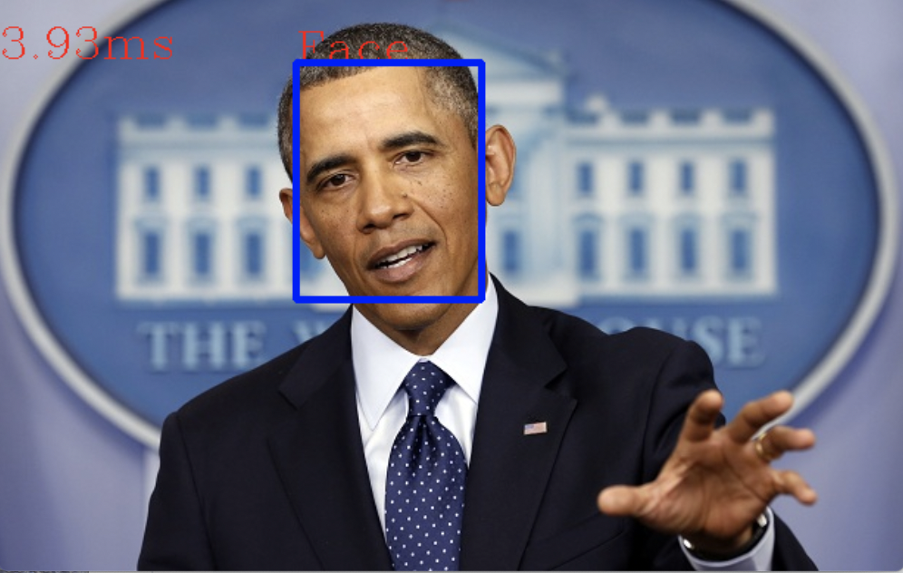
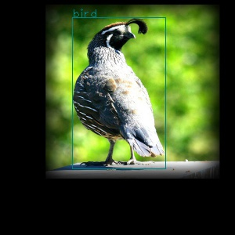
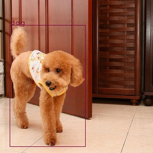
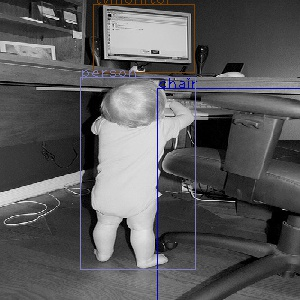

# ssd-models 轻量级SSD检测器
[](LICENSE)


## 快速上手

从[releases](https://github.com/imistyrain/ssd-models/releases)下载转换好的[Face模型](https://github.com/imistyrain/ssd-face/releases/download/1.0/MobileNetSSD_face.caffemodel), 将其置于Face文件夹下.
下载demo脚本, opencv版[demo.py](https://github.com/imistyrain/ssd-models/releases/download/1.0/demo.py)或caffe版[demo_caffe.py](https://github.com/imistyrain/ssd-models/releases/download/1.0/demo_caffe.py)

    Note: opencv版需要依赖3.4.*及以上, pip install opencv-python==3.4.0.14
    调整脚本里设置模型的路径，选择从文件夹测试或者从摄像头运行, python python/demo.py



## 1. 下载并编译[ssd](https://github.com/imistyrain/ssd) 
[原始版本](https://github.com/weiliu89/caffe)仅能在ubuntu下编译通过，这里提供一个可以在Windows、Linux和MAC跨平台编译的[版本](https://github.com/imistyrain/ssd)，并且添加了可分离卷积层、ShuffleNet和Focalloss的实现，支持python 2.7、3.5、3.6、3.7等

```
git clone https://github.com/imistyrain/ssd
mkdir build
cd build
make -j8
```
为方便起见，后文将下载的ssd所在文件夹记为$SSD_ROOT

## 2.python运行
从[releases](https://github.com/imistyrain/ssd-models/releases/)里下载训练好的[模型voc_mobilenet_iter_73000.caffemodel](https://github.com/imistyrain/ssd-models/releases/download/1.0/voc_mobilenet_iter_73000.caffemodel), 转换模型, 合并BN层, 加快运行速度
```
python python/merge_bn.py
```
也可直接下载转换好的[模型](https://github.com/imistyrain/ssd-models/releases/download/1.0/MobileNetSSD_voc.caffemodel)
```
python python/demo.py
```
用980Ti花费4天训了一个模型，日志见[voc_MobileNetSSD_980Ti_120k.log](https://github.com/imistyrain/ssd-models/releases/download/1.0/voc_MobileNetSSD_980Ti_120k.log), mAP 61.8

## 3. C++运行
本项目使用CMake进行跨平台编译并且需要OpenCV版本为3.4及以上

```
git clone https://github.com/imistyrain/ssd-models
cd ssd-models
./build.sh
```
Note: 如果遇到找不到mropencv.h等文件, 可参考opencv跨平台自动化配置[MRHead](https://github.com/imistyrain/MRHead)


## 4. 数据准备

我们提供了下载和转换一些典型公开检测数据集如[VOC](https://pjreddie.com)、[fddb](http://vis-www.cs.umass.edu/fddb/)、[FreiHand](https://lmb.informatik.uni-freiburg.de/Publications/2019/ZAB19/)、[Brainwash](https://www.mpi-inf.mpg.de/departments/computer-vision-and-machine-learning/software-and-datasets/)、[WiderPerson](http://www.cbsr.ia.ac.cn/users/sfzhang/WiderPerson/)的脚本[download_data.sh](download_data.sh)，你可以解开里面的注释以便下载所需的文件, 里面含有自动转换成训练所需lmdb的脚本.

如果要训练自定义目标的话需要标注数据, 推荐一个好用的标注工具:[MRLabeler](https://github.com/imistyrain/MRLabeler)

如果暂时没有转换好的数据的话，本项目提供一个人脸检测领域常用的已经转换好的[fddb](http://vis-www.cs.umass.edu/fddb)的[lmdb](http://pan.baidu.com/s/1pK8jglP)(百度网盘， 密码：g33x，约102M, 训练日志见[fddb_MobileNetSSD_P40_120k.log](https://github.com/imistyrain/ssd-models/releases/download/1.0/fddb_MobileNetSSD_P40_120k.log), 并将其置于data/fddb下，这个步骤过程可以参见[将fddb标注转换为VOC格式标注](http://blog.csdn.net/minstyrain/article/details/77938596)

数据结构如下所示:

```
   ${SSD-MODELS}
    `-- data
        `-- voc
            |-- lmdb
            |   |-- VOC0712_trainval_lmdb
            |   |-- VOC0712_test_lmdb
        `-- fddb
            |-- lmdb
            |   |-- trainval_lmdb
            |   |-- test_lmdb
        `-- Hand
            |-- lmdb
            |   |-- trainval_lmdb
            |   |-- test_lmdb
        ...
```

所有的数据都要转换为lmdb格式，有3种方式:
- 第一种是使用[caffe-ssd](https://github.com/weiliu89/caffe/tree/ssd)里使用的脚本:[create_list.sh](https://github.com/weiliu89/caffe/blob/ssd/data/VOC0712/create_list.sh)和[create_data.sh](https://github.com/weiliu89/caffe/blob/ssd/data/VOC0712/create_data.sh)，好处是资料比较多，步骤也很详细，缺点是比较繁琐，需要先转换成VOC格式，对文件位置也有较高的要求
- 第二种是使用本项目中的[create_lmdb.py](create_lmdb.py),其解除了对文件位置严格的限制，而且能一键式运行，省心省力

    原始ssd需要将数据放到指定目录并且要运行两个脚本，其对文件位置有这严苛的要求，稍有不慎就会弄错.本项目根据其中的内容提取成了create_list.py文件，其包含两个函数，create_list把训练图片路径及其标注按行写入到trainval.txt中，把测试图片路径及其标注按行写入到test.txt中，把测试图片路径及其大小（高度、宽度）写入到test_name_size.txt中

    ```
    Note:由于fddb中含有多级目录,为了兼容SSD及YOLO的训练结构要求,此脚本将路径中的"/"转换为了"_"
    ```

    ```
    python python/create_lmdb.py
    ```
- 最后一种是使用[convert2lmdb.py](python/convert2lmdb.py)

    其使用python直接生成训练所需的lmdb文件，不必再繁琐的转换成VOC格式，直接和pytorch似的加载自定义数据集，也可进行转换好的lmdb数据进行可视化，方便检查其中的问题，其还给出了数据集的统计分布和推荐的anchor设置.

    对于[FaceMask](https://mp.weixin.qq.com/s?__biz=MzIyMDY2MTUyNg==&mid=2247483755&idx=1&sn=102c178eeb359617c67aa8cc615a90ce&chksm=97c9d312a0be5a04935c63857e05b1b00a8b5c298d6fa0ffca35e8d026c09169c3ca62e620a2&mpshare=1&scene=1&srcid=&sharer_sharetime=1585995397229&sharer_shareid=cfe18de94f3a847e5ada278bbc490577&exportkey=AQVINroZXgLbi%2BgTqyA1uG8%3D&pass_ticket=mWIVA3QAV6s8RB5LXrZtstiHlu59hNAG7UDhJOnA43G9Pe8xmbQCr%2FksIbtTbVUi#rd)数据, 结果如下:
    ```
    face: 10596
    face_mask: 2985
    -------Total: 13581
    Iteration: 26: Accuracy: 71.57%
    Recommanded aspect ratios(width/height)
    Width    Height   Height/Width
    0.011      0.019     1.8
    0.020      0.034     1.7
    0.031      0.058     1.8
    0.052      0.086     1.7
    0.082      0.119     1.5
    0.111      0.188     1.7
    0.180      0.268     1.5
    0.280      0.404     1.4
    0.435      0.570     1.3
    ```
    

### 数据检查

[showpreprocess.py](python/showpreprocess.py)可以对预处理后的数据进行可视化，便于分析其中存在的问题，可参考[SSD 中的数据增强](https://blog.csdn.net/mzpmzk/article/details/100161187)

  

## 5 启动训练

训练MobileNetSSD系列网络可以使用, 记得修改要训练的数据集路径
```
./run.sh
```
本项目还提供了一个非常小的网络，可以使用如下命令训练:
```
python train.py
```

## [FLOPs分析](https://blog.csdn.net/minstyrain/article/details/80348123)
```
svd15 90x160
layer name              Filter Shape     Output Size      Params   Flops        Ratio
Convolution1            (4, 3, 3, 3)     (1, 4, 160, 90)  108      1555200      7.087%
Convolution2            (4, 4, 3, 3)     (1, 4, 160, 90)  144      2073600      9.449%
Convolution3            (8, 4, 3, 3)     (1, 8, 80, 45)   288      1036800      4.724%
Convolution4            (8, 8, 3, 3)     (1, 8, 80, 45)   576      2073600      9.449%
Convolution5            (24, 8, 3, 3)    (1, 24, 40, 23)  1728     1589760      7.244%
Convolution6            (24, 24, 3, 3)   (1, 24, 40, 23)  5184     4769280      21.732%
Convolution7            (24, 24, 1, 1)   (1, 24, 40, 23)  576      529920       2.415%
Convolution8            (24, 24, 1, 1)   (1, 24, 40, 23)  576      529920       2.415%
Convolution9            (24, 24, 1, 1)   (1, 24, 40, 23)  576      529920       2.415%
Convolution10           (24, 24, 3, 3)   (1, 24, 20, 12)  5184     1244160      5.669%
conv3_2_norm_mbox_loc   (8, 24, 3, 3)    (1, 8, 40, 23)   1728     1589760      7.244%
conv3_2_norm_mbox_conf  (4, 24, 3, 3)    (1, 4, 40, 23)   864      794880       3.622%
conv6_2_mbox_loc        (8, 24, 3, 3)    (1, 8, 40, 23)   1728     1589760      7.244%
conv6_2_mbox_conf       (4, 24, 3, 3)    (1, 4, 40, 23)   864      794880       3.622%
conv7_2_mbox_loc        (16, 24, 3, 3)   (1, 16, 20, 12)  3456     829440       3.78%
conv7_2_mbox_conf       (8, 24, 3, 3)    (1, 8, 20, 12)   1728     414720       1.89%
Layers num: 39
Total number of parameters:  25308
Total number of FLOPs:  21945600
```

aizoo28 96x96
```
layer name               Filter Shape     Output Size      Params   Flops        Ratio
Convolution1             (32, 3, 3, 3)    (1, 32, 96, 96)  864      7962624      9.455%
Convolution2             (64, 32, 3, 3)   (1, 64, 48, 48)  18432    42467328     50.424%
Convolution3             (64, 64, 3, 3)   (1, 64, 24, 24)  36864    21233664     25.212%
Convolution4             (64, 64, 3, 3)   (1, 64, 12, 12)  36864    5308416      6.303%
Convolution5             (128, 64, 3, 3)  (1, 128, 6, 6)   73728    2654208      3.152%
Convolution6             (128, 128, 3, 3) (1, 128, 3, 3)   147456   1327104      1.576%
Convolution7             (128, 128, 3, 3) (1, 128, 2, 2)   147456   589824       0.7%
Convolution8             (128, 128, 3, 3) (1, 128, 1, 1)   147456   147456       0.175%
conv2d_3_norm_mbox_loc   (12, 64, 3, 3)   (1, 12, 12, 12)  6912     995328       1.182%
conv2d_3_norm_mbox_conf  (6, 64, 3, 3)    (1, 6, 12, 12)   3456     497664       0.591%
conv2d_4_mbox_loc        (12, 128, 3, 3)  (1, 12, 6, 6)    13824    497664       0.591%
conv2d_4_mbox_conf       (6, 128, 3, 3)   (1, 6, 6, 6)     6912     248832       0.295%
conv2d_5_mbox_loc        (12, 128, 3, 3)  (1, 12, 3, 3)    13824    124416       0.148%
conv2d_5_mbox_conf       (6, 128, 3, 3)   (1, 6, 3, 3)     6912     62208        0.074%
conv2d_6_mbox_loc        (12, 128, 3, 3)  (1, 12, 2, 2)    13824    55296        0.066%
conv2d_6_mbox_conf       (6, 128, 3, 3)   (1, 6, 2, 2)     6912     27648        0.033%
conv2d_7_mbox_loc        (12, 128, 3, 3)  (1, 12, 1, 1)    13824    13824        0.016%
conv2d_7_mbox_conf       (6, 128, 3, 3)   (1, 6, 1, 1)     6912     6912         0.008%
Layers num: 47
Total number of parameters:  702432
Total number of FLOPs:  84220416
```
```
MobileNetSSD 300x300
Layers num: 47
Total number of parameters:  5492672
Total number of FLOPs:  1124416960
```
## 训练日志及预训练模型

| dataset | model | model_size | iters| mAP | log |
| ---- | ---- | ---- | ---- | ---- | ---- |
voc | [MobileNetSSD](https://github.com/imistyrain/ssd-models/releases/download/1.0/voc_mobilenet_iter_73000.caffemodel) | 22M| 120000 | 61.9 | [voc_MobileNetSSD_980Ti_120k.log](https://github.com/imistyrain/ssd-models/releases/download/1.0/voc_MobileNetSSD_980Ti_120k.log)
fddb | [MobileNetSSD](https://github.com/imistyrain/ssd-models/releases/download/1.0/fddb_iter_6000.caffemodel) | 22M | 6000 | 89.58 |[fddb_MobileNetSSS_1060_6k.log](https://github.com/imistyrain/ssd-models/releases/download/1.0/fddb_MobileNetSSS_1060_6k.log)
fddb | [aizoo28](https://github.com/imistyrain/ssd-models/releases/download/1.0/fddb_aizoo28_320x320_iter_6000.caffemodel)| 2.8M | 6000 | 89.37 | [fddb_aizoo28_320x320_6k.log](https://github.com/imistyrain/ssd-models/releases/download/1.0/fddb_aizoo28_320x320_6k.log)
fddb | [svd15](https://github.com/imistyrain/ssd-models/releases/download/1.0/fddb_svd15_90x160.tar.gz) | 115K | 13000 | 78.2 | [fddb_svd15_90x160.log](https://github.com/imistyrain/ssd-models/releases/download/1.0/fddb_svd15_90x160.log)
widerface| [MobileNetSSD](https://github.com/imistyrain/ssd-models/releases/download/1.0/widerface_iter_118000.caffemodel) | 22M | 90000 | 43.6 | [widerface_MobileNetSSD_980Ti_120k.log](https://github.com/imistyrain/ssd-models/releases/download/1.0/widerface_MobileNetSSD_980Ti_120k.log)
Person |[aizoo28](https://github.com/imistyrain/ssd-models/releases/download/1.0/Person_aizoo28_320x320_iter_20000.caffemodel) | 2.8M | 22000 | 50.5| [Person_aizoo28_320x320.log](https://github.com/imistyrain/ssd-models/releases/download/1.0/Person_aizoo28_320x320.log)
Hand | [aizoo28](https://github.com/imistyrain/ssd-models/releases/download/1.0/Hand_aizoo28_320x320_iter_16000.caffemodel) | 2.8M | 16000 | 89.77 | [Hand_aizoo28_320x320.log](https://github.com/imistyrain/ssd-models/releases/download/1.0/Hand_aizoo28_320x320.log)
Head | [aizoo28](https://github.com/imistyrain/ssd-models/releases/download/1.0/Head_aizoo28_320x320_iter_103000.caffemodel) | 2.8M | 103000 | 55.2 | [Head_aizoo28_320x320.log](https://github.com/imistyrain/ssd-models/releases/download/1.0/Head_aizoo28_320x320.log)
Mask | [aizoo28](https://github.com/imistyrain/ssd-models/releases/download/1.0/Mask_aizoo28_320x320_iter_60000.zip) | 2.8M | 60000 | 82.11 | [Mask_aizoo28_320x320.log](https://github.com/imistyrain/ssd-models/releases/download/1.0/Mask_aizoo28_320x320.log)
Car | [aizoo28](https://github.com/imistyrain/ssd-models/releases/download/1.0/Car_aizoo28_320x320_iter_92000.caffemodel) | 2.8M | 92000 | 34.74 | [Car_aizoo28_320x320.log](https://github.com/imistyrain/ssd-models/releases/download/1.0/Car_aizoo28_320x320.log)

## 一键式运行

```
python train.py
```
### vgg_ssd
    不推荐, 模型大(90M)且慢
    python ssd/ssd_train.py
    python ssd/ssd_test.py

## 参考

* [人脸检测最佳实践](https://blog.csdn.net/minstyrain/article/details/104870285)

* [yolo-face](https://github.com/imistyrain/yolo-face)